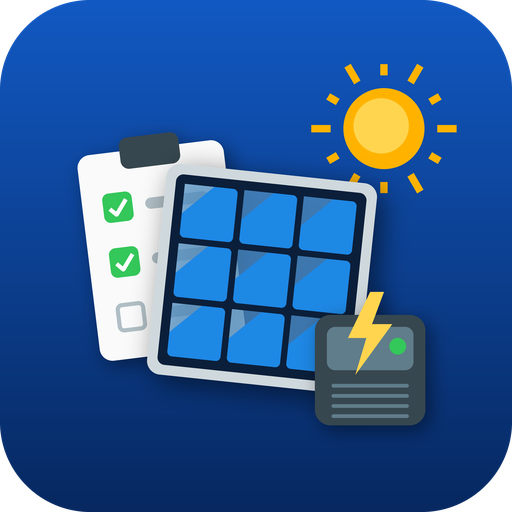

<p align="center"></p>

# ElectroApp

Aplicație Android pentru electricieni care proiectează și montează sisteme fotovoltaice
(monofazat, trifazat, cu stocare, injecție în rețea JT / MT). Ține un **registru de lucrări**
în care fiecare fișă adună beneficiarul, locul de consum, releveul de șantier, măsurătorile,
soluția tehnică adoptată, pașii de racordare și documentele emise. Funcționează complet offline.

## Stare: etapele E0 + E1

Disponibil acum:

- **Registru de lucrări** — fișe cu număr de înregistrare `FL-<an>-<nr>`, flux de stări
  (Lead → Releveu → Dimensionare → Ofertă → ATR → Execuție → PIF → Certificat → Exploatare),
  istoric jurnalizat al tranzițiilor, căutare și filtre.
- **Fișa de lucrare** — beneficiar (PF/PJ, calitate), tip lucrare, loc de consum (adresă,
  localitate cu autocomplete, operator de distribuție, cod POD, nivel de tensiune, branșament
  mono/trifazat, putere aprobată/contractată, disjunctor, schemă de legare la pământ, grup de
  măsură, destinația clădirii).
- **Clienți** — persoane fizice/juridice/asociații/instituții; date din agenda telefonului, adresă din locație (OpenStreetMap), completare automată de la ANAF după CUI; furnizor de energie din listă (sau off-grid), cod client, POD.
- **Profil firmă** — date firmă, atestat ANRE, electrician semnatar (grad, legitimație).
- Temă luminoasă / întunecată.
- **Actualizare din aplicație** din GitHub Releases (verificare la pornire + Setări).
- **Jurnal de depanare** — fiecare operație și fiecare crash se înregistrează pe telefon,
  cu niveluri configurabile; „Trimite logurile" atașează fișierul cu antet de diagnostic
  la un raport de problemă.
- **Releveu de șantier (E2)** — plane de montaj cu azimut și înclinare citite din
  senzorii telefonului, capacitatea fiecărui plan după retragerile P118-1/2025,
  obstacole și umbrire, tabloul existent, traseele de cablu și zonele climatice;
  datele intră automat în estimare.
- **Măsurători instrumentale (E2)** — valorile de pe teren, la releveu, la punerea în
  funcțiune și la service, fiecare cu verdict automat și referință normativă: verificările
  de categoria 1 din IEC 62446-1 (continuitate, polaritate, Voc și Isc pe string corectate
  la STC, izolație DC, pornire invertor, anti-islanding, limitare export), plus priza de
  pământ, bucla de defect, DDR și dezechilibrul între faze. Nimic nu se suprascrie: o
  corectură înlocuiește valoarea veche și o păstrează în istoric.
- **Fotografii de șantier (E2)** — pe secțiuni (plan, tablou, contor, traseu, amplasare,
  PIF), cu descriere și coordonate, păstrate pe telefon.
- **Soluția tehnică (E1)** — estimarea sistemului din consum și amplasament: kWp, module,
  string-uri verificate (IEC 62548), invertor, stocare, producție pe județ, autoconsum,
  economie, regim prosumator; necesar de materiale și manoperă cu prețuri orientative;
  revizii salvate în fișă.
- **Documente PDF** — fișa sistemului fotovoltaic, ofertă materiale / manoperă / completă
  și buletinul de verificări la punerea în funcțiune (IEC 62446-1), cu datele firmei,
  electricianului și beneficiarului; versiuni și hash per document.

Urmează (vezi [docs/CERCETARE.md](docs/CERCETARE.md) §4.4):

| Etapă | Conținut |
|---|---|
| E1 ✅ | Motor de calcul: string-uri, circuit AC (I7-2011), cablu DC și protecții, stocare, randament pe județ (model offline); PVGIS cu coordonate urmează în E2 |
| E2 ✅ | Releveu tehnic, măsurători instrumentale cu verdicte IEC 62446-1, fotografii de șantier, buletin de verificări la PIF |
| E3 | Rapoarte PDF rămase: proces-verbal de recepție, buletin PRAM, listă DIU |
| E4 | Catalog echipamente, urmărire racordare/avize (ATR, DIU, certificat), export/backup |
| E5 | Sincronizare cu electroprep.ro, hartă, QR serii, MT |

## Instalare

Descarcă ultimul APK de la adresa stabilă
[releases/latest/download/ElectroApp.apk](https://github.com/CristianCasapu/ElectroApp/releases/latest/download/ElectroApp.apk)
(sau din [Releases](https://github.com/CristianCasapu/ElectroApp/releases)) și instalează-l pe
telefon (Android 7.0+; acceptă „Instalare din surse necunoscute"). Aplicația instalată își caută
singură actualizările din Setări.

## Compilare

```bash
flutter pub get
dart run build_runner build --delete-conflicting-outputs
flutter analyze && flutter test
flutter build apk --debug
```

Build-ul de release cere `android/key.properties` cu keystore-ul propriu (nu este în repo).

## Documentație

- [docs/CERCETARE.md](docs/CERCETARE.md) — cadrul legislativ RO/UE (ANRE, prosumatori, RfG,
  P118-1, stocare), formulele de dimensionare, peisajul competitiv, stack-ul și specificația
  registrului de lucrări cu modelul de date.
- [CLAUDE.md](CLAUDE.md) — convenții de dezvoltare.

## Licență

Cod sursă publicat pentru transparență. Toate drepturile rezervate — Cristian Casapu.

---
v0.1.5
